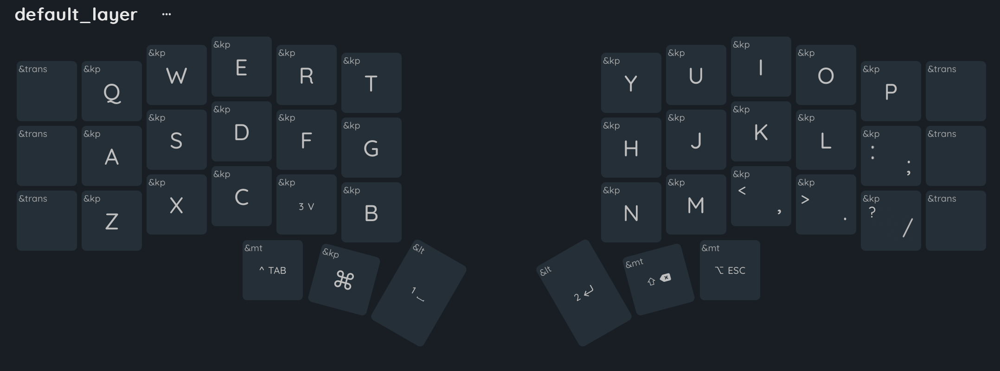
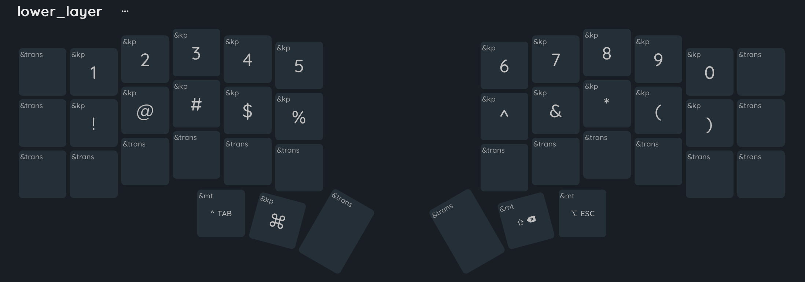
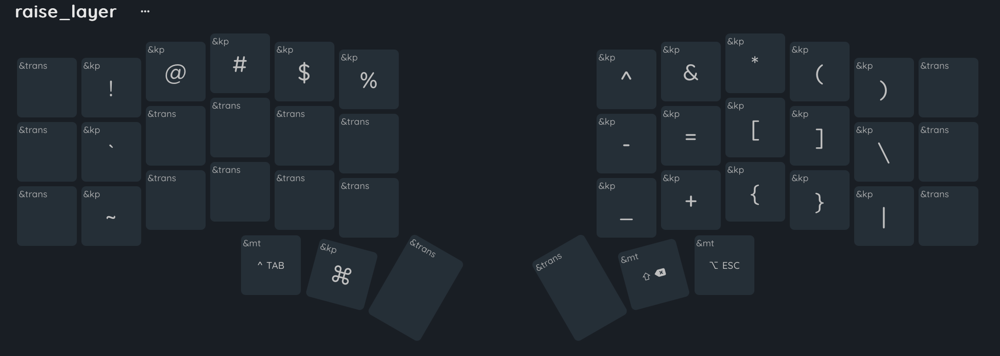
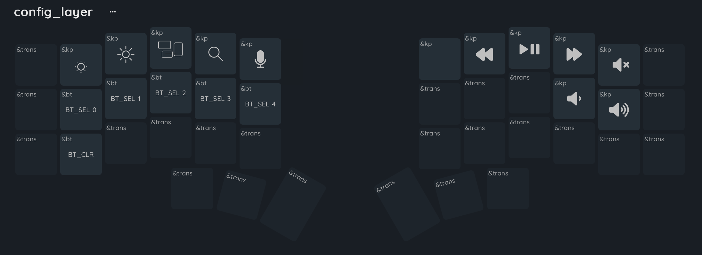
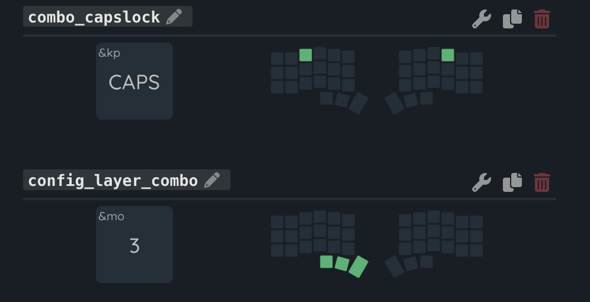

# Corne ZMK 5-column keyboard
## Anti-Typing layout

Switching from a staggered to a corne keyboard can be challenging, as it initially feels unnatural. Additionally, a 5-column layout can sometimes limit the ability to assign extra functionality or make layers more efficient. The purpose of the **Anti-Typing layout** is to embrace a more personalized, innovative design that empowers users. It keeps the 5-column Corne's simpler, minimalist structure while making it more similar to the traditional QWERTY keyboard, thus reducing the learning curve. For example, to type a colon (":") in the 5-column layout, you would typically need to switch to another layer and press the key assigned to the colon. However, in this layout, in the default layer you simply press `SHIFT` + `;` to produce a colon (":"), just as you would on a regular laptop keyboard.

The name is inspired by Taylor Swift's 10th album *Midnights* and my sleepless nights spent building this layout, during which the album kept me company, with Anti-Hero playing on an endless loop.

If you'd like to use this layout you just need to download the `latest` firmware version from the **Releases** section.

### Layout philosophy
> [!NOTE]
> This is a work in progress.

- Focused on simplicity, and minimalistic in its core.
- Prioritize ergonomics while reducing the learning curve.
- Reduce the finger movement and layer switching.

## Layers
> [!NOTE] 
> If you see more than one symbol in the same key, it means that it can be activated in the same layer by pressing ⌘, ⌥, ⌃, ⇧ as you would normally do it in Mac, or SHIFT, CONTROL and ALT in Windows.

> [!IMPORTANT]  
> The symbols \` and ~ on a Mac US keyboard yield § and ±, respectively. To correctly generate ` on raise layer, British English must be activated. However, ~ still does not produce ~ and instead generates ¬.

## Combos

Layout viewer: https://nickcoutsos.github.io/keymap-editor/
